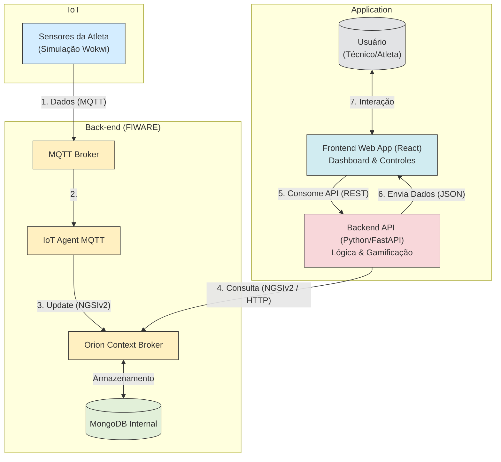

# 💡 Passa Bola – Projeto de Monitoramento e Gamificação para Futebol Feminino

Este projeto foi desenvolvido para as disciplinas de **Edge Computing & Computer Systems** e **Computational Thinking with Python** na FIAP. A solução integra um backend em **Python com FastAPI**, um frontend moderno em **React com TypeScript**, e a plataforma **FIWARE** — hospedada em uma máquina virtual no Microsoft Azure para simular o monitoramento de atletas em tempo real.

O objetivo principal é criar um sistema que não apenas coleta e exibe sinais vitais, como frequência cardíaca e saturação de oxigênio, mas também aplica uma camada de **gamificação** para engajar as atletas e analisar a performance de forma inovadora.

🔗 **Vídeo explicativo no YouTube:** [Clique aqui para abrir](https://www.youtube.com/watch?v=dQw4w9WgXcQ)

-----

## 📦 Funcionalidades Principais

  * **Monitoramento em Tempo Real:** Coleta dados de frequência cardíaca (BPM) e saturação de oxigênio (SpO2) da atleta via FIWARE, com atualizações automáticas na interface.
  * **Análise de Sinais Vitais:** Processa e classifica os dados em categorias (ex: Baixo, Normal, Elevado) com alertas visuais para feedback imediato sobre a condição fisiológica da atleta.
  * **Histórico de Dados:** Armazena e exibe o histórico de medições em gráficos interativos, permitindo uma análise temporal da performance durante os treinos.
  * **Gamificação ("Jogo Passa Bola"):**
      * **Execução de Passes:** Permite simular a execução de passes, cuja pontuação é calculada dinamicamente com base nos sinais vitais da atleta.
      * **Sistema de Pontuação Dinâmico:** Passes executados em momentos de alta intensidade (BPM elevado e boa saturação) recebem mais pontos.
      * **Qualidade do Passe:** Cada passe é classificado como "Perfeito", "Bom", "Regular" ou "Fraco".
      * **Sequências e Bônus:** O sistema rastreia e incentiva sequências de passes de alta qualidade.
      * **"Hitmits":** Registra passes excepcionais como conquistas que podem ser consultadas posteriormente.
  * **Interface Interativa:** Um dashboard moderno e responsivo que centraliza todas as funcionalidades, desde a visualização de dados até o controle do jogo e configurações do sistema.

-----

## ✅ Dependências

Antes de executar o projeto, certifique-se de instalar as dependências necessárias em seus respectivos diretórios.

**Backend (Python):** (Ver `backend/requirements.txt`)

  * `fastapi`
  * `uvicorn`
  * `requests`
  * `pydantic`
  * `python-multipart`

**Frontend (Node.js):** (Ver `package.json`)

  * `react` e `react-dom`
  * `typescript`
  * `tailwindcss`
  * `shadcn/ui` (para componentes de UI)
  * `recharts` (para gráficos)
  * `react-router-dom` (para navegação)

-----

## 🧰 Componentes Utilizados

  * **Backend:** Python com o framework FastAPI para criar uma API RESTful robusta e rápida.
  * **Frontend:** React com TypeScript e Vite para uma experiência de desenvolvimento moderna e uma interface de usuário reativa.
  * **Plataforma IoT:** FIWARE Orion Context Broker, recebendo dados simulados e disponibilizando-os para o backend.
  * **Estilização:** Tailwind CSS e `shadcn/ui` para uma interface elegante, consistente e responsiva.

-----

## 🏛️ Arquitetura da Solução

A aplicação é dividida em quatro camadas principais que trabalham em conjunto para coletar, processar e exibir os dados em tempo real.



#### Fluxo de Dados:

1.  **Coleta de Dados:** A simulação no **Wokwi** gera dados de sensores (BPM e SpO2) da atleta.
2.  **Broker de Contexto:** Os dados são enviados para o **FIWARE Orion Context Broker**, que armazena o estado mais recente da entidade da atleta.
3.  **Processamento no Backend:** O **Backend em Python** consulta o FIWARE periodicamente para obter os dados atualizados. Ele processa essas informações, aplica a lógica de gamificação e as expõe através de uma API RESTful.
4.  **Interação e Visualização:** O **Frontend em React** consome a API do backend para exibir os dados em um dashboard interativo. As ações do usuário (como executar um passe) são enviadas de volta para o backend para processamento.

-----

## 💻 Montagem e Execução

**Passo a Passo**

1.  **Backend:**

      * Navegue até a pasta `backend`.
      * Instale as dependências: `pip install -r requirements.txt`
      * Execute o servidor: `python run.py`
      * A API estará disponível em `http://localhost:8000` e a documentação interativa em `http://localhost:8000/docs`.

2.  **Frontend:**

      * Na raiz do projeto, instale as dependências: `npm install`
      * Execute o ambiente de desenvolvimento: `npm run dev`
      * A aplicação estará disponível em `http://localhost:8080`.

-----

## 🔌 Rotas da API (Backend)

O backend, construído com FastAPI, expõe uma API RESTful para ser consumida pelo frontend. A documentação interativa da API (Swagger UI) está disponível em `http://localhost:8000/docs`.

### Atleta

Endpoints relacionados aos dados brutos e ao histórico da atleta.

-----

#### `GET /atleta/dados`

Obtém os dados mais recentes da atleta, juntamente com uma análise do status dos sinais vitais.

  * **Método:** `GET`
  * **Resposta (Sucesso - 200 OK):**

<!-- end list -->

```json
{
  "dados": {
    "id": "urn:ngsi-ld:Atleta:0001",
    "tipo": "Atleta",
    "timestamp": "18:30:05",
    "time_instant": "2023-10-27T18:30:05.123Z",
    "batimento": 125,
    "saturacao": 98.5,
    "piscar": "ON"
  },
  "status_batimento": {
    "status": "Elevado",
    "cor": "bpm-elevated",
    "alerta": "⚡"
  },
  "status_saturacao": {
    "status": "Excelente",
    "cor": "success",
    "alerta": "✅"
  },
  "conectado": true,
  "ultima_atualizacao": "2023-10-27T21:30:05.543Z"
}
```

-----

#### `GET /atleta/historico`

Retorna uma lista com o histórico de dados coletados da atleta, limitado pela configuração `limite_historico`.

  * **Método:** `GET`
  * **Resposta (Sucesso - 200 OK):**

<!-- end list -->

```json
{
  "historico": [
    { "timestamp": "18:30:03", "batimento": 122, "saturacao": 98.2, ... },
    { "timestamp": "18:30:05", "batimento": 125, "saturacao": 98.5, ... }
  ],
  "total_registros": 50,
  "limite_configurado": 50
}
```

-----

### Jogo

Endpoints para controlar o estado do jogo e registrar as ações da atleta.

-----

#### `POST /jogo/iniciar`

Inicia uma nova partida, zerando as estatísticas e marcando o tempo de início.

  * **Método:** `POST`
  * **Resposta (Sucesso - 200 OK):**

<!-- end list -->

```json
{
  "sucesso": true,
  "mensagem": "Jogo iniciado com sucesso!"
}
```

-----

#### `POST /jogo/parar`

Finaliza a partida atual e retorna um relatório final.

  * **Método:** `POST`
  * **Resposta (Sucesso - 200 OK):**

<!-- end list -->

```json
{
  "sucesso": true,
  "relatorio": {
    "pontuacao_total": 150,
    "passes_executados": 45,
    "passes_perfeitos": 12,
    "melhor_sequencia": 8,
    "tempo_total": 360,
    "hitmits": [...]
  }
}
```

-----

#### `POST /jogo/passe`

Registra a execução de um passe. A API calcula a pontuação e a qualidade com base nos dados vitais atuais da atleta.

  * **Método:** `POST`
  * **Resposta (Sucesso - 200 OK):**

<!-- end list -->

```json
{
  "sucesso": true,
  "pontos": 4,
  "qualidade": "Perfeito",
  "batimento": 130,
  "saturacao": 99.1,
  "sequencia": 5
}
```

-----

#### `GET /jogo/status`

Retorna o estado atual do jogo, incluindo estatísticas em tempo real.

  * **Método:** `GET`
  * **Resposta (Sucesso - 200 OK):**

<!-- end list -->

```json
{
  "jogo_ativo": true,
  "estatisticas": {
    "pontuacao": 75,
    "passes_executados": 20,
    "passes_perfeitos": 5,
    "tempo_inicio": "2023-10-27T21:25:00.000Z",
    "melhor_sequencia": 5,
    "sequencia_atual": 5
  },
  "tempo_jogo": 180,
  "hitmits": [...]
}
```

-----

### Configurações e Saúde

Endpoints para gerenciar o comportamento do sistema e verificar seu estado.

-----

#### `GET /configuracoes`

Retorna as configurações atuais do sistema (intervalos, limites de BPM e SpO2).

  * **Método:** `GET`
  * **Resposta (Sucesso - 200 OK):**

<!-- end list -->

```json
{
  "intervalo_atualizacao": 2,
  "limite_historico": 50,
  "limites_batimento": { "baixo": 60, "normal": 100, "alto": 150 },
  "limites_saturacao": { "baixo": 95, "bom": 98 }
}
```

-----

#### `POST /configuracoes`

Atualiza as configurações do sistema.

  * **Método:** `POST`
  * **Corpo da Requisição (Body):**

<!-- end list -->

```json
{
  "intervalo_atualizacao": 3,
  "limite_historico": 100,
  "limites_batimento": { "baixo": 65, "normal": 105, "alto": 160 },
  "limites_saturacao": { "baixo": 94, "bom": 97 }
}
```

  * **Resposta (Sucesso - 200 OK):**

<!-- end list -->

```json
{
  "sucesso": true,
  "mensagem": "Configurações atualizadas com sucesso",
  "configuracoes": { ... }
}
```

-----

#### `GET /health`

Verifica a saúde da aplicação, incluindo a conexão com o FIWARE.

  * **Método:** `GET`
  * **Resposta (Sucesso - 200 OK):**

<!-- end list -->

```json
{
  "status": "healthy",
  "timestamp": "2023-10-27T21:30:05.543Z",
  "fiware_connected": true,
  "game_active": true,
  "total_records": 50
}
```

-----

## 👥 Membros do Grupo

  * Diogo Pelinson – RM563321
  * Jessica Tavares – RM566220
  * Luara Soares – RM561266
  * Miguel Amaro – RM566200
  * Pedro Henrique Caires – RM562344

-----

## 📂 Sobre

Este projeto é uma solução completa que demonstra a integração de tecnologias de ponta para atender a um desafio prático no esporte. Ele serve como uma base sólida para a evolução de sistemas de monitoramento e gamificação, aplicando conceitos de IoT, desenvolvimento de APIs e interfaces de usuário modernas.
